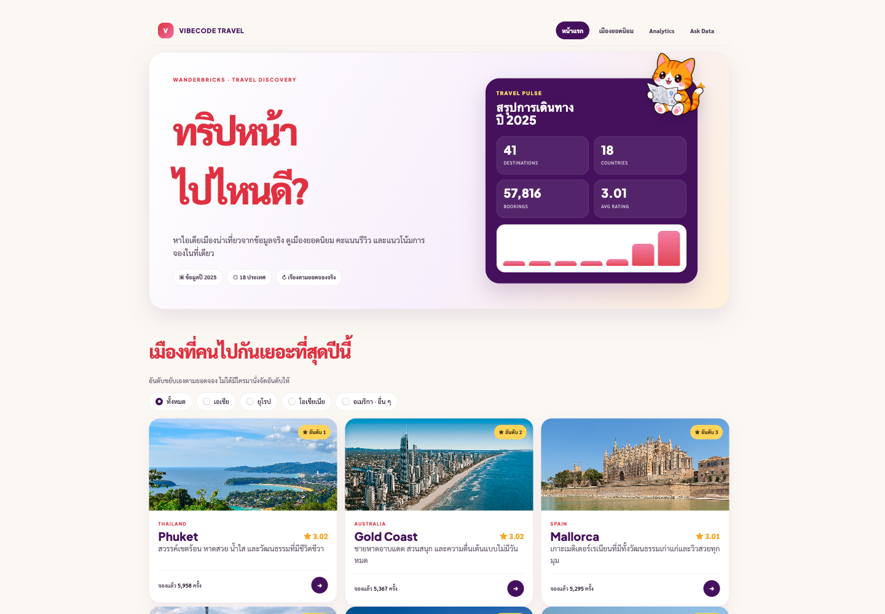
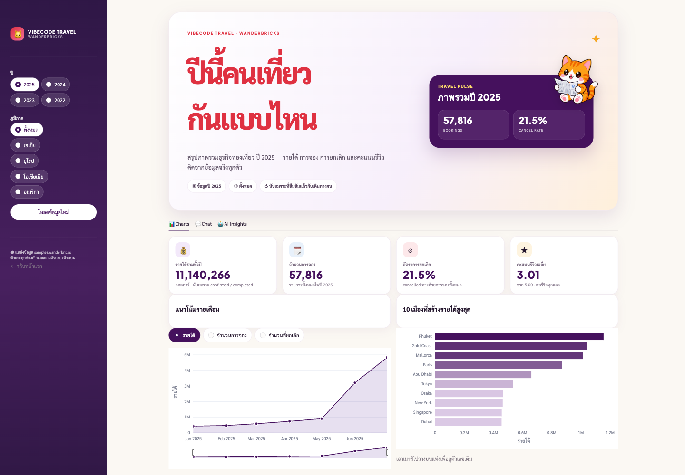

# Day 3 · Databricks & Data Products

โฟลเดอร์นี้คือของทั้งหมดที่ใช้ในคาบ — ทำตามได้ตั้งแต่ต้นจนได้แอปที่ deploy จริง

```
Day3/
  README.md              ← อยู่ตรงนี้
  HOWTO_step_by_step.md  วิธีกดทุกขั้น ตั้งแต่เปิด Genie Code ถึง deploy
  SUMMARY_Day3.md        สรุปหลังคาบ ส่งให้ผู้เรียน
  PRECOURSE_Day4_Snowflake.md

  starter/               ← ★ เริ่มที่นี่
    SPEC.md                โจทย์ · อะไรไม่ทำ · แบบไหนถือว่าเสร็จ
    AGENTS.md              กฎธุรกิจ + โค้ดต่อ SQL warehouse และ Genie ที่ทดสอบแล้ว
    DESIGN.md              ผังหน้าร้าน หน้าแดชบอร์ด + กับดัก Streamlit
    assets.py              รูปเมือง 12 เมือง + คำโปรยไทย
    catto.png              มาสคอต
    day1-web/              เว็บ VibeCode Travel ที่ทำไว้ Day 1 (ใช้เป็นโครงหน้าตา)
    backup/                app.yaml · requirements.txt — ใช้เมื่อ AI เขียนผิดเท่านั้น

  prompt/                00–09 ก็อปวางทีละขั้น · เริ่มที่ README.md
  backup_data/           CSV สำรอง ใช้เมื่อเปิด samples.wanderbricks ไม่ได้
  screenshots/           ภาพหน้าตาปลายทาง 2 หน้า
  demo-final/            เฉลยเต็ม — theme.py · landing.py · app.py
```

> **ลำดับ prompt ที่ถูก** `00 → 03 → 04 → 05 → 08 → 07 → 09`
> เลขไฟล์ไม่ได้เรียงตามลำดับที่ใช้จริง — ดู `prompt/README.md` ก่อน

---

## ปลายทางหน้าตาแบบนี้

### หน้าร้าน — เปิด App URL แล้วเจอหน้านี้ก่อน



topbar · hero 2 คอลัมน์ (ขวาเป็นการ์ด Travel Pulse มีแมว) · การ์ดเมือง 3 คอลัมน์
เรียงตามยอดจองจริง · แบนเนอร์ปุ่มแดงเข้าแดชบอร์ด

### แดชบอร์ด — กดปุ่มแล้วมาที่ `?view=analytics`



sidebar ตัวกรอง ปี/ภูมิภาค · KPI 4 ใบ · กราฟ 2 ตัวที่ซูมและเลือกตัวชี้วัดได้ ·
ตารางอันดับ · แท็บ Charts / Chat / AI Insights

---

## วิธีทำ

- **ทางหลัก: ทำบนเบราว์เซอร์ล้วน** — ให้ Genie Code บน Databricks เขียนไฟล์แอปให้
- ทางถอย: ใช้ `starter/` ที่เตรียมไว้ แล้ว deploy เลย (ใช้เมื่อเวลาไม่พอ)
- BONUS หลังคลาส: Claude Code / Copilot + `AGENTS.md` + `DESIGN.md` ในเครื่องตัวเอง

### ลำดับ prompt

| ไฟล์ | ทำอะไร |
|---|---|
| `00_warmup_genie` | ลอง Genie Code ครั้งแรกใน SQL Editor |
| `01_read_spec` | ให้ AI อ่าน SPEC ก่อนเริ่ม |
| `02_dashboard_sql` | SQL ของ Dataset สำหรับ Dashboard |
| `03_dashboard_build` | ให้ Genie Code สร้าง Dashboard |
| `04_genie_agent` | สร้าง Genie Agent + Instructions |
| `05_genie_examplesql` | ใส่ Example SQL แทนการฝากกฎไว้กับข้อความ |
| `06_app_plan` | ขอ Plan ของแอปก่อนเขียนโค้ด |
| `07_app_build` | สร้าง 5 ไฟล์ — theme · landing · app · app.yaml · requirements |
| `08_app_resources` | ผูก SQL warehouse + Genie Agent เข้ากับ App |
| `09_verify` | เช็กก่อนส่ง |

---

## กฎธุรกิจที่ใช้ทั้งคาบ

- **Revenue** นับเฉพาะ `confirmed` และ `completed`
- **Cancellation rate** = `cancelled` ÷ การจองทั้งหมดในช่วงที่เลือก
- ข้อมูลอยู่ **ปี 2025** — Query 2023 จะได้ผลน้อยมาก
- ย่อ `reviews` ให้เหลือ 1 แถวต่อ 1 booking ก่อน join
  ไม่งั้นแถวบานจาก 57,816 เป็น 94,223 แล้วยอดเงินถูกนับซ้ำ

## ข้อควรระวังของ Free Edition

- 3 apps ต่อ account · App ถูก Stop อัตโนมัติหลังรันสูงสุด ~24 ชม. (โค้ดไม่หาย กด Start ใหม่ได้)
- SQL warehouse 2X-Small แบบ Serverless ตัวเดียว
- มีโควตา Compute ต่อวัน เกินแล้วต้องรอรีเซ็ต
- **ห้ามอัปข้อมูลงานจริงหรือข้อมูลลับ** — Databricks สงวนสิทธิ์นำข้อมูลใน Free Edition ไปฝึกโมเดล
